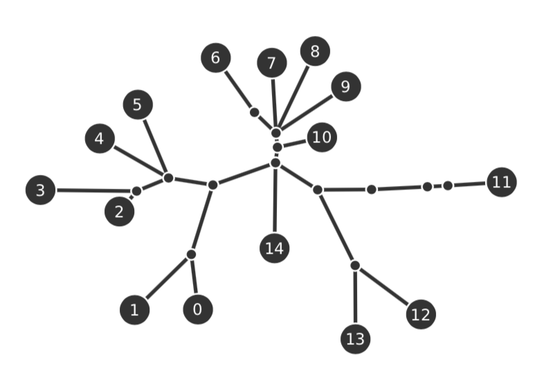
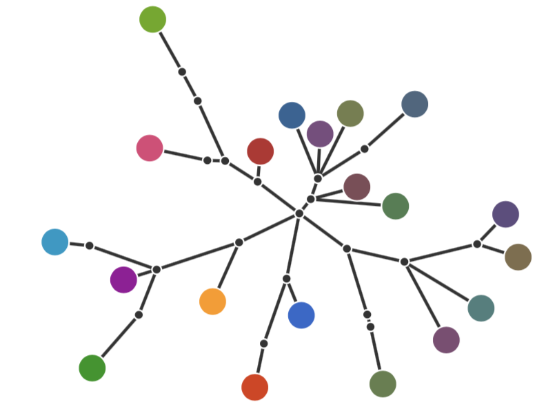
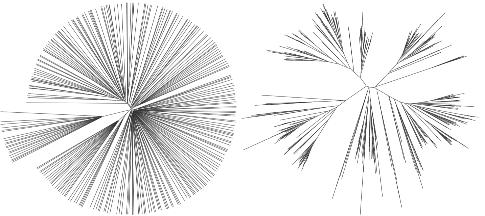
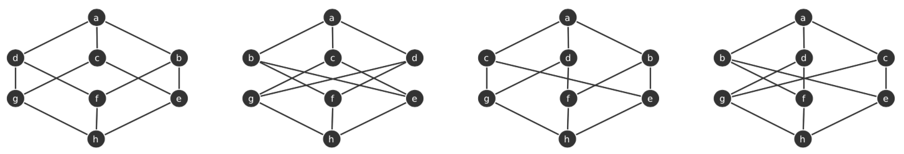
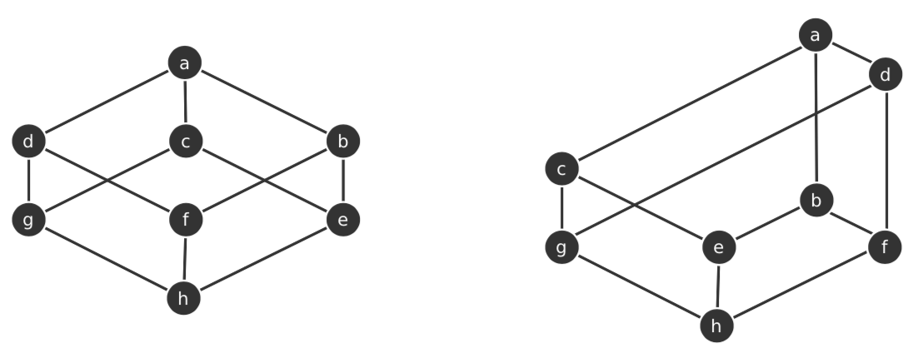
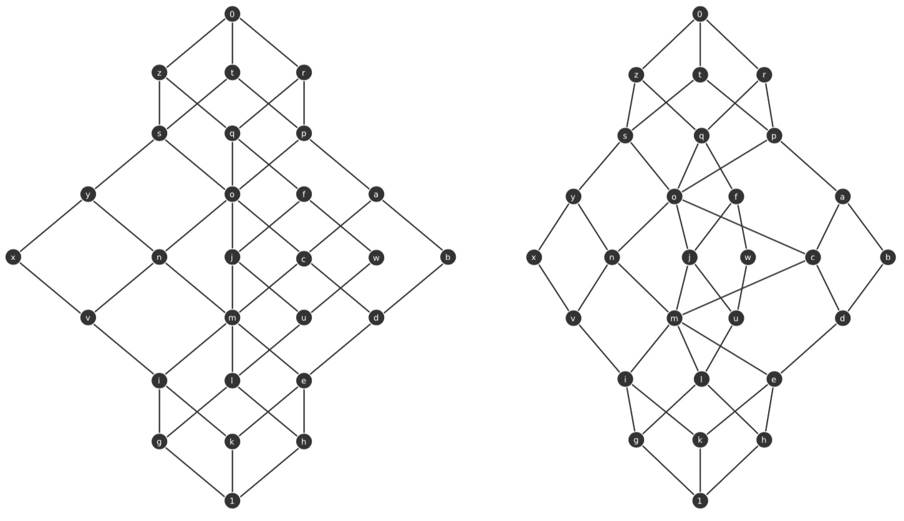
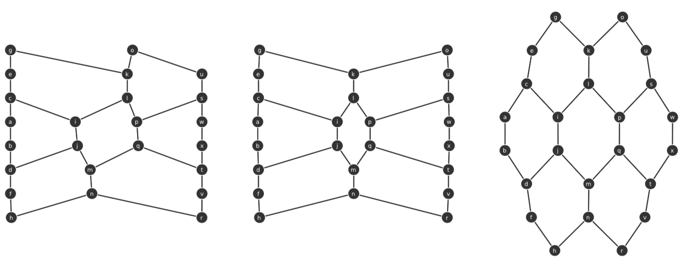
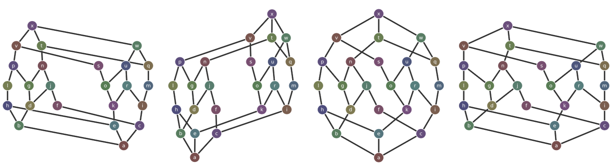
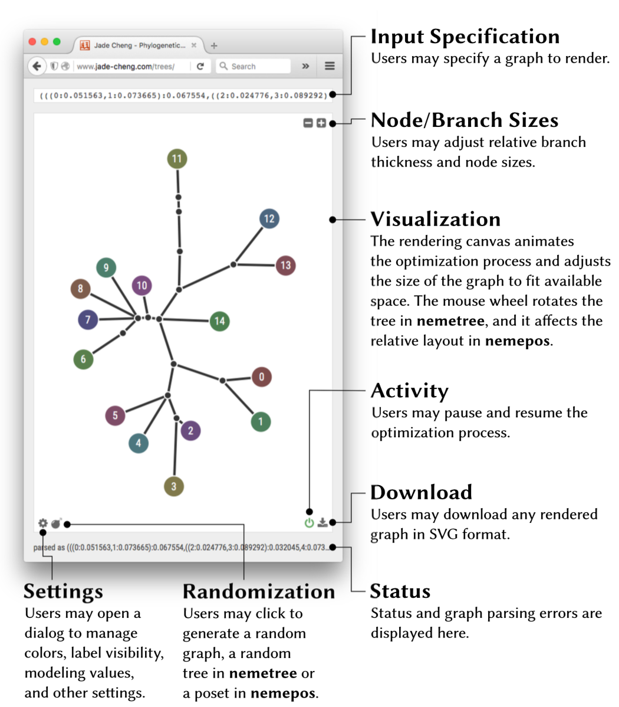
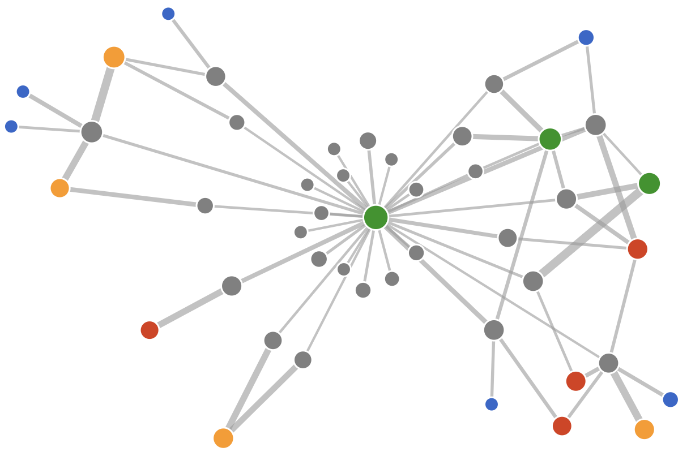

# Coulomb simulation & Graph visualization

Graph drawing can be a difficult problem. Coulomb simulation is used in a class of algorithms for drawing graphs in an aesthetically-pleasing way, and it does not require special knowledge about graph theory. In a Coulomb simulation, we assign forces among the set of edges and the set of nodes. Based on their relative positions, we use these forces either to simulate the motion of the edges and nodes or to minimize their energy. [Kobourov, S.G., 2012] We also call these methods force-directed algorithms.

## Coulomb simulation

When an electrostatic force acts between two or more charged particles within a system, a potential energy can be assigned to that system. This energy is a result of conservative Coulomb forces and is based on the relative positions and magnitudes of the point charges.  [Coulomb's law](https://en.wikipedia.org/wiki/Coulomb%27s_law "Coulomb's low") declares the magnitude of the electrostatic force of interaction between two point charges and the electrostatic potential energy stored in a system of charged particles. It is analogous to Isaac Newton's inverse-square law of gravitation. Coulomb simulation is a physics simulation of such a system.

## Layout optimization

When the graph is simulated as a system of charged particles, its layout is achieved through motion simulations or energy minimization. We use the latter and apply the [Nelder-Mead simplex method](https://en.wikipedia.org/wiki/Nelder%E2%80%93Mead_method "NM") to minimize an objective function returning the electrostatic potential energy. Nelder-Mead optimization is an iterative process that continually refines a simplex of D + 1 vertices in D dimensions [Nelder, J.A. and Mead, R., 1965]. The optimizer evaluates the objective function at each iteration and explore the parameter space through four actions, reflection, expansion, contraction, and shrinkage. The effect of each action is controlled by a scalar constant supplied to the algorithm.

## Interactive web applications

We present [nemetree](http://www.jade-cheng.com/graphs/nemetree "Interactive Tree Visualization") and [nemepos](http://www.jade-cheng.com/graphs/nemepos "Interactive DAG/POSET Visualization"), two web services dedicated to delivering clean, accurate, and presentation-ready visualizations of trees and partially ordered sets, respectively. We achieve optimal graph layouts using numerical optimization over an objective function through Coulomb modeling of an electrostatic field.

### Tree visualization: [nemetree](http://www.jade-cheng.com/graphs/nemetree "Interactive Tree Visualization")

Visualizing tree structures play an important role in many fields. For example, a traditional way to illustrate phylogenetic relationships among species is to model them using a tree, i.e. a phylogeny or an additive tree. This type of tree forms the basics to represent differences between species and to analyze those differences statistically.

Our web application accepts input tree structure in the [Newick format](https://en.wikipedia.org/wiki/Newick_format "Newick").  For example, (A:1,B:1,C:1)D; is a tree of three equal-length edges and four nodes where D is the hub.

Figure: Example tree produced by nemetree with labeled nodes, input "(((0: 0.051563, 1: 0.073665): 0.067554, ((2: 0.024776, 3: 0.089292): 0.032045, 4: 0.073556, 5: 0.073828): 0.041653): 0.061673, (((6: 0.062106): 0.027735, 7: 0.065435, 8: 0.084353, 9: 0.078113): 0.013201, 10: 0.042450): 0.014533, ((((11: 0.050176): 0.019014): 0.051895): 0.050033, (12: 0.076249, 13: 0.068482): 0.078430): 0.046452, 14: 0.079462);"*

*Figure: Example tree produced by nemetree with colored nodes, input "((0: 0.038578, (1: 0.043605): 0.067155): 0.064858, (2: 0.063234, ((3: 0.069020): 0.047470, 4: 0.033729, (5: 0.033865): 0.069477): 0.084625): 0.065165, (((6: 0.057527): 0.017290, ((7: 0.058629): 0.032198): 0.064344): 0.037682, 8: 0.029823): 0.051076, ((9: 0.066724, 10: 0.043596, 11: 0.071007, (12: 0.065640): 0.053974): 0.021215, 13: 0.046589, 14: 0.082981): 0.017811, (((15: 0.040201, 16: 0.041971): 0.072980, 17: 0.087440, 18: 0.086618): 0.057469, ((19: 0.057143): 0.012432): 0.067246): 0.057702);"*

*Figure: Examples of large trees produced by nemetree. The left tree contains 528 nodes. The right tree contains 1014 nodes. When dealing with large trees we recommend disabling the optimizer.*

### DAG visualization: [nemepos](http://www.jade-cheng.com/graphs/nemepos "Interactive DAG/POSET Visualization")

[Hasse diagrams](https://en.wikipedia.org/wiki/Hasse_diagram "Hasse diagram") visualize strict [partial order relations](https://en.wikipedia.org/wiki/Partially_ordered_set "poset") through a layered graphical representation of their transitive reductions ([directed acyclic graphs](https://en.wikipedia.org/wiki/Directed_acyclic_graph "DAG")).  A Hasse diagram uniquely defines a finite partially ordered set (poset), but a poset maps to many Hasse diagrams. We call them isomorphisms. Even though Hasse diagrams are simple and intuitive, it's often hard to find a "good" one. A "bad" Hasse representation is mathematically correct but usually useless in practice [Freese, R., 2004]

*Figure: Four isomorphisms representing the lattice of the subset of three. nemepos produces the first because it has the fewest edge crossings; input "h<(g,f,e); g<(d,c); f<(d,b); e<(c,b); d<a; c<a; b<a"*

Our web application applies a compact layering schema for level assignment, a heuristic-based cross minimization and a targeted local cross elimination for within-level ordering, and a flexible sibling distances for internal structure exploration. See diagram comparisons below.

*Figure: Level assignments for the lattice of the subset of three. People commonly draw and prefer the left diagram. The right diagram has a different level assignment, and it was produced when minimizing the total number of different slopes [Stephan, J., 1987]. nemepos produces the left.*

*Figure: Within-level ordering and cross elimination for modular lattice on three generators. The left diagram is drawn perfectly by hand and the right diagram is generated by nemepos. They have the same number of edge-crossings and demonstrate a good similarity.*

*Figure: Sibling distances for Graphene's single-atom-thick hexagonal lattice. nemepos produces all three diagrams by adjusting the nodeForce and edgeForce model parameters through the JSON configuration.*

*Figure: Another example of different sibling distances produced by nemepos through model parameter tuning. They depict vastly different internal structures and empowers the user to explore these structures; input "c<(i, f), j<n, k<(o, r), r<u, e<(k, h), g<(n, p), i<(m, r), a<(b, c, e), d<(j, g), h<l, f<j, n<t, m<q, s<v, o<(s, u), p<v, l<p, b<(d, h), t<x, u<w, v<x, w<x, q<(t, w)"*

### Implementation

[nemetree](http://www.jade-cheng.com/graphs/nemetree "Interactive Tree Visualization") and [nemepos](http://www.jade-cheng.com/graphs/nemepos "Interactive DAG/POSET Visualization") are freely available and require no installation or registration for use. The websites perform admirably using any modern web browser supporting JavaScript and SVG. The software was developed in HTML, CSS, and TypeScript and is hosted with the Apache web server.

The Nelder-Mead implementation determines the coefficients for reflection, expansion, contraction, and shrinkage based on the number of nodes in the graph and recommendations from [Gao, F. and Han, L., 2012]. For nemetree, the optimizer chooses an initial vertex by evenly positioning each node based on the number of parents in its branch. For nemepos, the optimizer evenly distributes and centers nodes within each layer. Optimization terminates after a series of iterations leaves the simplex with two conditions met: 1. the difference between its best and worst objective values is less than a constant value ε1, and 2. the maximum distance between any two vertices is less than another constant value ε2.

*Figure: The applications allow users to specify graph structures in text format and adjust the model and rendering configuration through a JSON editor. The applications utilize the mouse wheel to rotate the tree and quickly adjust the settings related to the relative layout of the Hasse diagram. The applications animate the progression of the optimization and provide a method to pause and resume the process. All rendered graphs may be downloaded as SVG.*

## D3JS force

So far, we presented packaged solutions using Coulomb's physics simulation to visualize two families of graphs, trees and DAGs/posets. General visualizations of network graphs can also benefit from Coulomb simulation.  [D3js](https://d3js.org/ "D3js") provides a flexible framework through its force layout. The crux of applying D3js-force is to set up all components and parameters needed for the Coulomb simulation, e.g. nodes, edges, charges, progression ticks, etc. For details on how to set up and visualize through a force simulation using D3js, we recommend this [blog post](http://d3indepth.com/force-layout/ "D3js force").

*Figure: Example D3js force visualization of a network graph for pairwise friendship relationships. This is neither a tree nor a DAG/poset. This visualization is produced with full-length tick progression, equal-negatively-charged nodes, center-node gravity, and variable link lengths.*

Besides the fact that [nemetree](http://www.jade-cheng.com/graphs/nemetree "Interactive Tree Visualization") and [nemepos](http://www.jade-cheng.com/graphs/nemepos "Interactive DAG/POSET Visualization") are created for specific graph types and ingest pre-defined text representations of graphs, the major difference compared to D3js is how the final layout of graphical components is achieved. The two packaged web applications minimize system energy and converge to the optimal layout through the Nelder-Mead optimization algorithm. D3js-force applies the concept of tick, and it does not guarantee a final minimal Coulomb energy nor an absolute optimal layout.

Instead, D3js offers fast computation for large graphs and leave it to the user to determine what's best for their particular use cases. Due to its flexibility and the power of Coulomb physics simulation, D3js not only is applicable to visualize general-purpose network graphs, it can also perform collision detection, gravity visualization, etc.

## Summary

We present [nemetree](http://www.jade-cheng.com/graphs/nemetree "Interactive Tree Visualization") and [nemepos](http://www.jade-cheng.com/graphs/nemepos "Interactive DAG/POSET Visualization"), two web services dedicated to delivering clean and presentation-ready visualizations of trees and DAGs/posets, respectively.  Both achieve graph layout through Coulomb simulation and numerical optimization.

- nemetree models tree components as like-signed charged particles with nodes constrained by the branches that connect them. It uses the Nelder-Mead algorithm to minimize the total potential energy of this system and reach an optimal tree layout

- nemepos computes Hasse topologies using compact layering, heuristic-based cross minimization, and targeted cross elimination. It also uses the Nelder-Mead algorithm to optimize the graph layout by modeling nodes as charged particles; nodes in the same layer are like-signed, and comparable nodes across layers are opposite-signed.

For general-purpose graph visualization through Coulomb simulation, we recommend [D3js](https://d3js.org/ "D3js home").  We've had success developing applications using this JavaScript library ourselves. With the power of physics simulation and D3js's web capability as well as its flexibility in force modeling, we find it straightforward to build user-friendly network visualizations.

Please contact jade.cheng@cs.au.dk or jade.cheng@strong.io for questions and suggestions.

# References

Kobourov, S.G., 2012. Spring embedders and force directed graph drawing algorithms. arXiv preprint arXiv:1201.3011.

Nelder, J.A. and Mead, R., 1965. A simplex method for function minimization. The computer journal, 7(4), pp.308-313.

Freese, R., 2004, February. Automated lattice drawing. In International Conference on Formal Concept Analysis (pp. 112-127). Springer, Berlin, Heidelberg.

Stephan, J., 1987. Liniendiagramme von verbnden.

Gao, F. and Han, L., 2012. Implementing the Nelder-Mead simplex algorithm with adaptive parameters. Computational Optimization and Applications, 51(1), pp.259-277.
